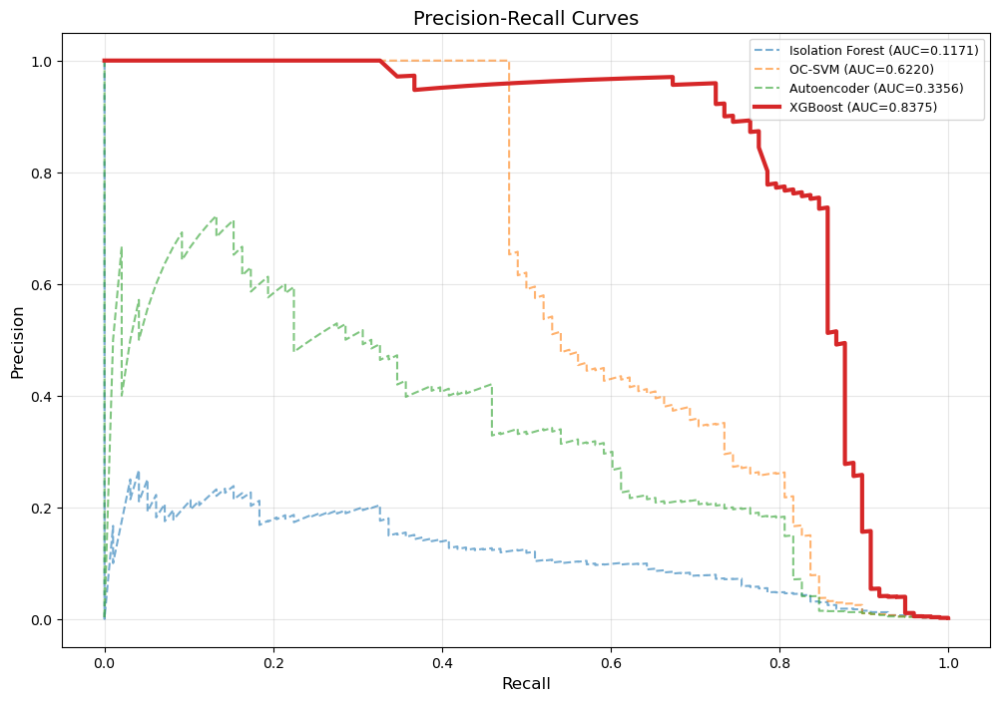

# 🚀 Credit Card Fraud Detection using Machine Learning

## 📌 Overview
This project focuses on detecting fraudulent credit card transactions under **extreme class imbalance (~0.17% fraud rate)** using both supervised and unsupervised machine learning techniques.

A comparative study was conducted between anomaly detection models and a supervised learning approach (XGBoost).

---

## 🎯 Objective
- Detect rare fraudulent transactions
- Compare anomaly detection vs supervised learning
- Evaluate using appropriate metrics for imbalanced data

---

## 🧠 Models Used

### 🔹 Unsupervised (Anomaly Detection)
- Isolation Forest
- One-Class SVM
- Autoencoder (Neural Network)

### 🔹 Supervised
- XGBoost (with class weighting)

---

## 📊 Evaluation Metrics
Due to class imbalance, the following metrics were used:
- Precision
- Recall
- F1-score
- **PR-AUC (Primary Metric)**

---

## 📈 Results

| Model            | Precision | Recall | F1 Score |
|------------------|----------|--------|---------|
| Isolation Forest | 0.097    | 0.643  | 0.168   |
| One-Class SVM    | 0.121    | 0.837  | 0.211   |
| Autoencoder      | 0.047    | 0.827  | 0.090   |
| **XGBoost**      | **0.512**| **0.867** | **0.644** |

---

## 📉 Precision-Recall Curve

---

## 💡 Key Insights

- XGBoost significantly outperformed anomaly detection models
- Unsupervised models achieved high recall but very low precision (high false positives)
- Precision-Recall metrics are more appropriate than accuracy for imbalanced datasets

---

## 📄 Research Paper

📘 Published version available here:  
👉 [Zenodo Link Here]

---

## 🛠️ Tech Stack
- Python
- Scikit-learn
- XGBoost
- NumPy / Pandas
- Matplotlib

---

## 🚀 Future Improvements
- Hybrid models (Supervised + Anomaly Detection)
- Real-time fraud detection pipeline
- Explainability (SHAP values)

---

## 👤 Author
Imtiaz Islam  
MS Computer Science – CUNY Baruch College
